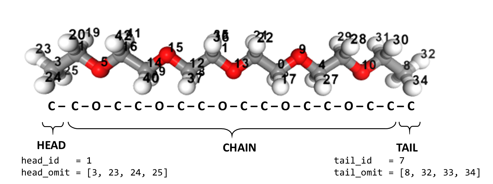

# GroPolBul Gromacs Polymer Builder
Generalized Amber Force Field (GAFF) for polymer electrolyte systems

# Polymer Electrolyte builder for MD simulations

This is a tutorial to build initial configurations and force field parameters required for the Classical Molecular dynamics simulation using GROMACS software of polymer electrolyte system PEO-LiTFSI. This tutorial is based on the jupyter notebook, written using different open-source tools. Before building the PE system, one has to answer the following questions:

Questions | In this tutorial
-------- | ----------------
*What is the monomer?* | -COCOCOCOC-
*No. of monomers in the polymer chain?* | 25
*What is the end group?* | -CH$_3$
*What is the salt?* | LiTFSI
*No. of polymers and salt ions* | 100,20

## Prerequisites

This tutorial assumes the user is familiar with Python (jupyter notebook) and MD simulations using GROMACS. The prerequisites for running the jupyter notebook are:

* [**GROMACS**](https://www.gromacs.org/)
* [*ambertools*](https://ambermd.org/AmberTools.php)
  	* antechamber
  	* prepgen
  	* tleap
* [**ACPYPE**](https://pypi.org/project/acpype/)
* **Python packages** 
    * jupyter
    * ASE
    * nglview

Run the initial cell to import python packages required for the tutorial and create a working directory.
```python
import numpy as np
import os
import nglview as ngl
from ase.io import read, write
WDIR='/home/harish/GroPolBul/tutorial/PEO-LiTFSI'
%mkdir {WDIR}
%cd {WDIR}
```

## Step-1: Parameterizing monomer
The monomer can be read from any structural file formats supported by *ASE* or can be provided as a SMILE format and then, *acpype* can be used to parameterize the monomer.
```python
monomer="COCCOCCOCCOC"
!rm PEO.acpype    # To remove old folder
!acpype -i {monomer} -b PEO -n 0 -o gmx
```
This will create a folder named **PEO.acpype** in the working directory containing all the GAFF parameter files and GROMACS topology files. The two important files are *PEO.pdb* and *PEO.ac* copied to outside of acpype folder for next steps.

The monomer can also be visualized using *nglview*, and atom indexes are labeled, which is helpful to define the *HEAD*,*CHAIN*, and *TAIL* parts of the monomer.

```python
#Visualize the molecule
mol=read('PEO.pdb')
vi=ngl.show_ase(mol);vi.add_label(radius=2,color='black',label_type='atomindex')
vi
```

{width=300px}


## Step-2: Defining the HEAD, CHAIN, and TAIL of the monomer
This is the most complicated step of this tutorial as it required to choose the two different atom indexes:

1. Head/Tail atom index numbers
2. The atom indexes needed to be omitted near Head/Tail ids.

```python
#Defining CHAIN HEAD and TAIL in the monomer directory
ac=open('PEO.ac',mode='r') #Reading .ac file
[next(ac) for _ in range(2)] #Skipping first two lines of text
l=ac.readlines() #Reading lines

#Breaking the parts of the monomer into CHAIN, HEAD and TAIL
chain=open('PEO.chain','w+');head=open('PEO.head','w+');tail=open('PEO.tail','w+')
#Atom index where head and tail of monomer; Check from above ngl view of mol
head_id=15
tail_id=1

head_omit=[16, 41, 42, 43]
tail_omit=[0, 17, 18, 19]

chain.write('HEAD_NAME '+str(l[head_id].split()[2])+'\n')
tail.write('HEAD_NAME '+str(l[head_id].split()[2])+'\n')
chain.write('TAIL_NAME '+str(l[tail_id].split()[2])+'\n')
head.write('TAIL_NAME '+str(l[tail_id].split()[2])+'\n')

for i in range(len(head_omit)):
	chain.write('OMIT_NAME '+str(l[int(head_omit[i])].split()[2])+'\n')
	tail.write('OMIT_NAME '+str(l[int(head_omit[i])].split()[2])+'\n')
chain.write('PRE_HEAD_TYPE '+str(l[tail_id].split()[9])+'\n')
tail.write('PRE_HEAD_TYPE '+str(l[tail_id].split()[9])+'\n')
tail.write('CHARGE 0')

for i in range(len(tail_omit)):
	chain.write('OMIT_NAME '+str(l[int(tail_omit[i])].split()[2])+'\n')
	head.write('OMIT_NAME '+str(l[int(tail_omit[i])].split()[2])+'\n')
chain.write('POST_TAIL_TYPE '+str(l[head_id].split()[9])+'\n')
chain.write('CHARGE 0')
head.write('POST_TAIL_TYPE '+str(l[head_id].split()[9])+'\n')
head.write('CHARGE 0')

chain.close();head.close();tail.close()

#Use prepgen to prepare the CHAIN, HEAD and TAIL res files
#Adds dummy atoms at the desired positions
!prepgen -i PEO.ac -o PEO.prepi -f prepi -m PEO.chain -rn PEO -rf PEO.res 
!prepgen -i PEO.ac -o HPT.prepi -f prepi -m PEO.head -rn HPT -rf HPT.res 
!prepgen -i PEO.ac -o TPT.prepi -f prepi -m PEO.tail -rn TPT -rf TPT.res 
```

ADD DETAILS ABOUT CHOOSING THE INDEXES AND FILE TYPES

## Step-3: Build and parameterize single polymer chain

## Step-4: Choose salt (cation+anion)

## Step-5: Build polymer electrolyte system

## Step-6: Run MD to test the input files
