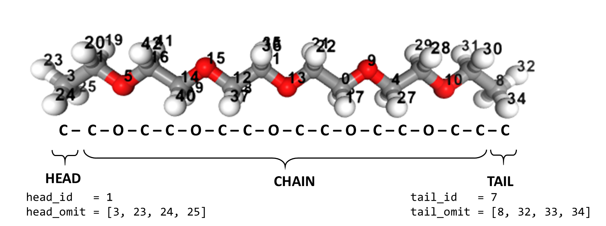
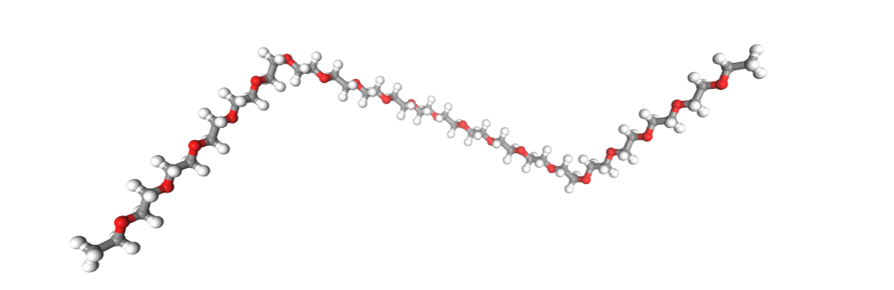
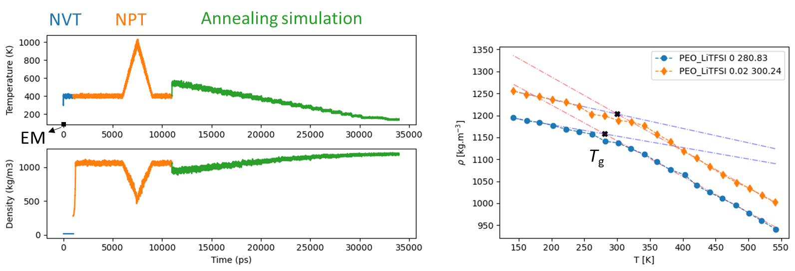

# (Gro)macs (Po)lymer (B)uilder
Tutorial on building polymer electrolyte systems and setting up Molecular Dynamics simulation for glass transition temperature (Tg) calculation using Generalized Amber Force Field (GAFF) parameters.

A workflow for creating the polymer force field parameters from the monomers, then preparing the configurations, topology, and MD parameters for running the polymer electrolyte simulations and calculating the glass transition parameters temperature.
{width=100px}
# Polymer Electrolyte builder for MD simulations

This is a tutorial on how to build initial configurations and force field parameters required for the Classical Molecular dynamics simulation using GROMACS software of polymer electrolyte system PEO-LiTFSI. This tutorial is based on the jupyter notebook, written using different open-source tools. Before building the PE system, one has to answer the following questions:

Questions | In this tutorial
-------- | ----------------
*What is the monomer?* | -COCOCOCOC-
*No. of monomers in the polymer chain?* | 25
*What is the end group?* | -CH_3
*What is the salt?* | LiTFSI
*No. of polymers and salt ions* | 100,20

## Prerequisites

This tutorial assumes the user is familiar with Python (jupyter notebook) and MD simulations using GROMACS. The prerequisites for running the jupyter notebook are:

* [**GROMACS**](https://www.gromacs.org/)
* [*ambertools*](https://ambermd.org/AmberTools.php)
  	* antechamber
  	* prepgen
  	* tleap
* **Python packages** 
    * jupyter
    * ASE
    * nglview
* [*intermol*](https://github.com/shirtsgroup/InterMol)
  
Run the initial cell to import python packages required for the tutorial and create a working directory.
```python
import numpy as np
import os
import nglview as ngl
from ase.io import read, write
WDIR='/home/harish/GroPolBul/tutorial/PEO-LiTFSI'
%mkdir {WDIR}
%cd {WDIR}
```

## Step-1: Parameterizing monomer
The monomer or short polymer chain can be read from any structural file formats such as *.pdb, *.xyz, and *.gro and then "antechamber" can be used to parameterize the monomer.
```python
#Use short polymer with repeat group, head and tail group
#repeat group: COCCOCCOCCOCCOC
#head and tail group: C
#Use antechamber (ambertools) to optimize and prameterise with AM1-BCC charges 
#antechamber options help:
#Usage: antechamber -i     input file name
#                   -fi    input file format
#                   -o     output file name
#                   -fo    output file format
#                   -c     charge method
#                   -nc    net molecular charge (int)
#                   -rn    residue name

!antechamber -i PEO_initial.pdb -fi pdb -o PEO.ac -fo ac -at gaff -an y -c bcc -nc 0 -rn PEO 
```

The monomer can also be visualized using *nglview*, and atom indexes are labeled, which is helpful to define the *HEAD*,*CHAIN*, and *TAIL* parts of the monomer.

```python
#Visualize the molecule
mol=read('PEO_initial.pdb')
vi=ngl.show_ase(mol);vi.add_label(radius=2,color='black',label_type='atomindex')
vi
```

{width=100px}


## Step-2: Defining the HEAD, CHAIN, and TAIL of the monomer
This is the most complicated step of this tutorial as it required to choose the two different atom indexes:

1. Head/Tail atom index numbers
2. The atom indexes needed to be omitted near Head/Tail ids.

```python
#Defining CHAIN HEAD and TAIL in the monomer directory
ac=open('PEO.ac',mode='r') #Reading .ac file
[next(ac) for _ in range(2)] #Skipping first two lines of text
l=ac.readlines() #Reading lines

#Breaking the parts of monomer to CHAIN, HEAD and TAIL
#Atom index where head and tail of monomer; Check from above ngl view of mol
#Change these values accordingly
head_id=1
tail_id=7

head_omit=[3, 23, 24, 25] #Atoms to omit near head
tail_omit=[8, 32, 33, 34] #Atoms to omit near tail
```
Using "prepgen" we will generate three *.prepi files
1. PEO.prepi : CHAIN
2. HPT.prepi : HEAD part
3. TPT.prepi : TAIL part

Using these files, we can build the polymer chain.

## Step-3: Build and parameterize single polymer chain
Here we need to set the variable "n_mono_repeat" which saves number of monomer units in the short polymer chain, and need to choose the variable "n_mono_pol" i.e. number of monomers in the desired polymer.
Next "tleap" is used to prepare the desired single polymer chain.
```python
#Build the desired homopolymer using above prepi files
%mkdir polymer
n_mono_repeat=5
n_mono_pol=25

repeat=" ".join(['PEO'] * int(int(n_mono_pol/n_mono_repeat)-2))
print('HPT '+str(repeat)+' TPT')

#Write the tleap input file to combine the preparatory files and build polymer chain
tleap=open('polymer/PEO_tleap.in','w+')
tleap.write('''source leaprc.gaff
loadamberprep PEO.prepi
loadamberprep HPT.prepi
loadamberprep TPT.prepi
mol = sequence {HPT '''+str(repeat)+''' TPT}
savepdb mol polymer/PEO_'''+str(n_mono_pol)+'''mer.pdb
saveamberparm mol polymer/PEO_'''+str(n_mono_pol)+'''mer.prmtop polymer/PEO_'''+str(n_mono_pol)+'''mer.inpcrd
quit''')
tleap.close()

!tleap -s -f polymer/PEO_tleap.in > polymer/PEO_tleap.out
```
This will generate *.prmtop and *.inpcrd files, these are coordinates and parameter files for AMBER. These files can be converted from AMBER to GROMACS using "intermol".
```python
#Converting AMBER to GROMACS using "intermol".
!python /home/harish/InterMol/intermol/convert.py --amb_in polymer/PEO_{n_mono_pol}mer.inpcrd polymer/PEO_{n_mono_pol}mer.prmtop --gromacs
```
Finally visualize the polymer using nglview.

{width=100px}

This will convert the AMBER files to GROMACS files,
1. *.gro : Initial structure file for single PEO polymer
2. *.top : Topology files consisiting force field parameters.

The topology file can then be broken into two itp files, 
1. *ff.itp* : Consits the default settings like combinaton rules, atomtypes and LJ parameters.  
2. *PEO_25mer.itp* : Consists the atomic paramerters like molecular weight, partial charges, bonded and non-bonded parameters.

## Step-4: Build polymer electrolyte system
Follow the *Step-1* for desired slat ions to genertate GAFF parameters, in this turtorial we use LiTFSI, corresponding *.pdb and *.itp files were provided. We also use scale the partial charges on LiTFSI by a factor of 0.75.

We can now generate the topology file for PEO_LiTFSI system with desired number of polymer chains and salt concnetration.
```python
### Make the topology file with ITP directory location and system details
ITPDIR='/home/harish/GroPolBul/tutorial/ITP'
npol=40;nmon=25;conc=0.08        
nions=npol*nmon*conc
topol=open('topol.top','w+')
topol.write('''#include "'''+str(ITPDIR)+'''/ff.itp"
#include "'''+str(ITPDIR)+'''/ITP/PEO_'''+str(nmon)+'''mer.itp"    
#include "'''+str(ITPDIR)+'''/ITP/li_75c.itp"  
#include "'''+str(ITPDIR)+'''/ITP/tfsi_75c.itp"
        
[ system ] 
PEO_LiTFSI_'''+str(conc)+'''

[ molecules ]
polymer   '''+str(npol)+'''     
LI    '''+str(nions)+'''
TFS   '''+str(nions)+'''
''')
topol.close() 
```
By using PACKMOL, we can now generate the initial configuration of the MD simulation box.
```python
#Build initial simulation boxes using packmol
pack=open('packmol.inp','w+')
pack.write('''tolerance 2.0
filetype pdb
output initial.pdb
structure PEO_25mer.pdb
  number '''+str(npol)+'''
  inside cube 0. 0. 0. 100. 
end structure

structure li.pdb
  number '''+str(nions)+'''
  inside cube 20. 20. 20. 50.
end structure

structure tfsi.pdb
  number '''+str(nions)+'''
  inside cube 20. 20. 20. 50.
end structure
        ''')
pack.close()
!packmol < packmol.inp
```
## Step-5: Molecular dynamics simulation workflow 
{width=100px}
{width=100px}


```

